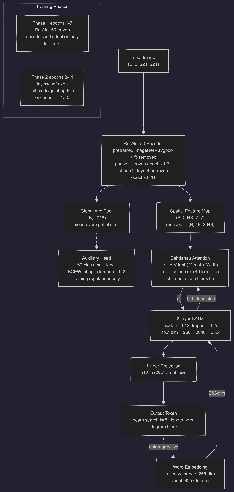

# Image Captioning with CNN-RNN and Spatial Attention on MS COCO

A deep learning system that generates natural-language descriptions of images by combining a ResNet-50 convolutional encoder with a Bahdanau attention mechanism and an LSTM sequence decoder. Trained and evaluated on the MS COCO 2014 dataset.

---

## Overview

This project implements an end-to-end image captioning pipeline following the encoder-decoder paradigm. The encoder extracts spatial feature maps from images using a pretrained ResNet-50; an additive attention layer learns to weight the 49 spatial regions at each decoding step; a two-layer LSTM generates captions word-by-word conditioned on the attended visual context. An auxiliary multi-label classification head on the encoder output serves as a regulariser by jointly optimising for object-presence prediction during training.

Inference uses beam search with length normalisation and trigram blocking to produce fluent, non-repetitive captions.

---

## Results

| Metric | Score |
|--------|-------|
| BLEU-1 | 0.6884 |
| BLEU-2 | 0.5160 |
| BLEU-3 | 0.3814 |
| BLEU-4 | 0.2808 |

Evaluated on 1,000 validation images against 5 human reference captions per image using NLTK `corpus_bleu` with smoothing. Training converged at epoch 11 (early stopped, patience = 3). Best validation loss: **3.3881**.

---

## Architecture



**Hyperparameters**

| Parameter | Value |
|-----------|-------|
| Word embedding dim | 256 |
| LSTM hidden units | 512 |
| LSTM layers | 2 |
| Dropout | 0.5 |
| Vocabulary size | 6,257 |
| Max sequence length | 50 |
| Batch size | 64 |
| Initial learning rate | 4e-4 |
| Fine-tune LR (encoder) | 1e-5 |
| CNN unfreeze epoch | 8 |
| Auxiliary loss weight | 0.2 |
| Label smoothing | 0.1 |
| Gradient clip norm | 5.0 |
| Beam width | 5 |
| Length normalisation α | 0.7 |

---

## Dataset

**MS COCO 2014** — Common Objects in Context

| Split | Images used | Caption pairs |
|-------|-------------|---------------|
| Train | 59,000 (50 % of full set) | 186,354 |
| Validation | — | 20,703 |

Source: [Kaggle — hariwh0/ms-coco-dataset](https://www.kaggle.com/datasets/hariwh0/ms-coco-dataset) via `kagglehub`.

Each image has 5 independent human-written captions. The vocabulary was built from training captions using a minimum-frequency threshold of 5, yielding 6,257 tokens including four special tokens: `<PAD>`, `<START>`, `<END>`, `<UNK>`.

---

## Training Details

### Loss Function

```
total_loss = caption_loss + 0.2 * aux_loss

caption_loss = CrossEntropyLoss(label_smoothing=0.1, ignore_index=PAD)
aux_loss     = BCEWithLogitsLoss (60-class object prediction)
```

### Optimisation

- **Optimiser**: Adam
- **LR scheduler**: `ReduceLROnPlateau` (factor 0.5, patience 1 epoch)
- **Early stopping**: patience = 3 epochs
- **CNN fine-tuning**: ResNet-50 is fully frozen for the first 7 epochs. At epoch 8, `layer4` is unfrozen with a separate learning rate of 1e-5.

### Training Dynamics

| Epoch | Phase | Encoder state | Train Loss | Val Loss |
|-------|-------|---------------|:----------:|:--------:|
| 1 | Phase 1 begins | ResNet-50 frozen | 4.2271 | — |
| 7 | Phase 1 ends | ResNet-50 frozen | — | — |
| 8 | Phase 2 begins | layer4 unfrozen (lr = 1e-5) | — | — |
| 11 | Early stop | layer4 unfrozen | 2.9714 | 3.3881 |

Epoch 8 marks the CNN unfreeze point. Allowing `layer4` gradients after the decoder has already converged on a reasonable attention strategy prevents the well-known catastrophic-forgetting failure mode where fine-tuning from epoch 1 collapses ImageNet representations before the decoder can make use of them. Early stopping fired at epoch 11 after patience (3 epochs without val-loss improvement) was exhausted.

---

## Inference

Captions are generated using **beam search**:

1. Encode the image with ResNet-50 to obtain 49 spatial features.
2. Initialise the LSTM hidden state from the pooled image features.
3. At each step, expand the top-k hypotheses (k = 5), apply attention over spatial features, and score next tokens.
4. Apply **length normalisation** (`score / length ^ 0.7`) to prevent the model from favouring short captions.
5. Apply **trigram blocking** — zero out the probability of any token whose addition would create a repeated 3-gram — to prevent degenerate repetition.

---
---

## Dependencies

```
torch >= 2.0
torchvision
numpy
Pillow
nltk
matplotlib
kagglehub
pickle (stdlib)
```

The notebook was executed on a **Kaggle kernel with an NVIDIA Tesla T4 GPU**. A GPU with at least 12 GB VRAM is recommended for the training loop at batch size 64.

---

## Key Implementation Notes

**Vocabulary construction**: Captions are lowercased and stripped of punctuation before tokenisation with `nltk.word_tokenize`. Words appearing fewer than 5 times in the training set are replaced with `<UNK>`. The resulting vocabulary (6,257 tokens) covers approximately 95 % of token occurrences in the training data.

**Image preprocessing**: Training images use `ColorJitter` augmentation followed by normalisation with ImageNet mean/std. Validation images use only resize + normalise — horizontal flipping is intentionally omitted because it would invalidate left/right spatial references in captions.

**Attention initialisation**: The LSTM hidden state is initialised from a linear projection of the mean-pooled encoder features rather than zeros, giving the decoder a meaningful starting point.

**Auxiliary head**: The 60-class multi-label head predicts the presence of COCO object categories from the pooled encoder features. It is optimised jointly with the caption loss at a weight of 0.2, acting as a structural regulariser that preserves object-level semantics in the encoder representations.

---

## Limitations

- The model was trained on 50 % of the COCO 2014 training split due to compute constraints; full-data training would improve BLEU scores.
- LSTM-based decoders are outperformed by transformer-based architectures (e.g., BLIP, OFA) on this benchmark. This project is intended as a foundational implementation rather than a state-of-the-art system.
- Attention weight visualisations (heatmaps overlaid on input images) were not generated; adding these would improve interpretability analysis.

---
